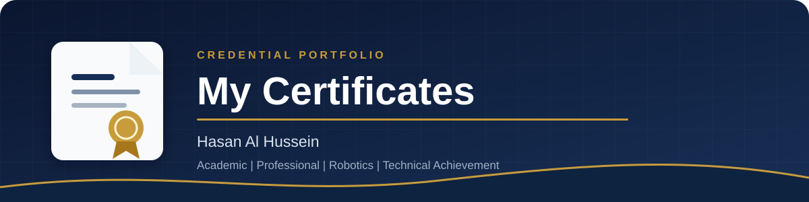
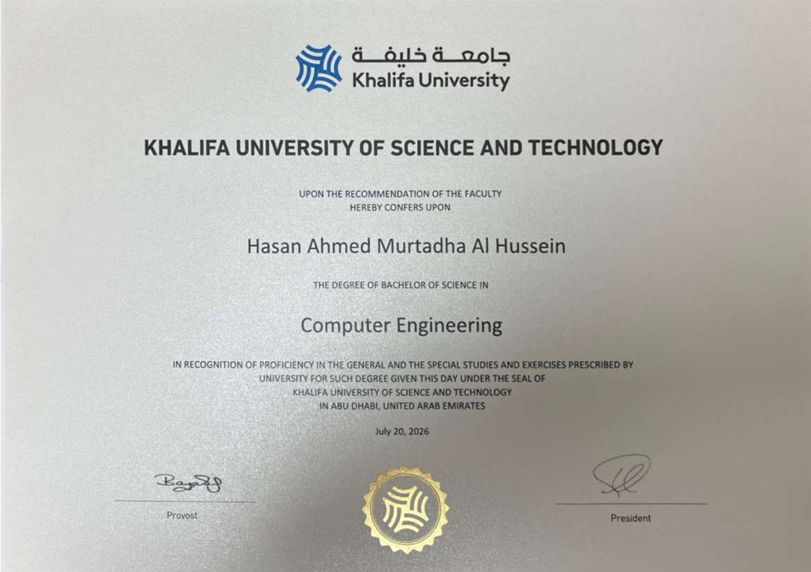
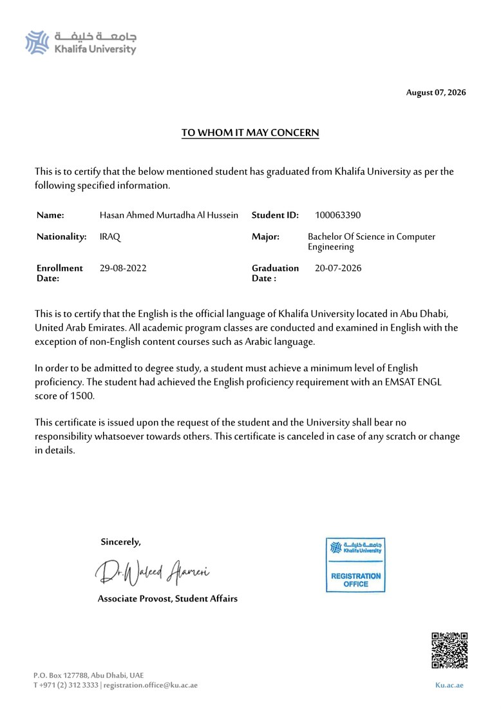
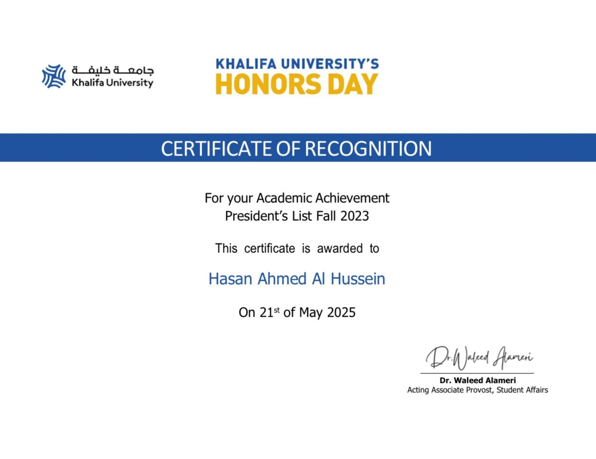
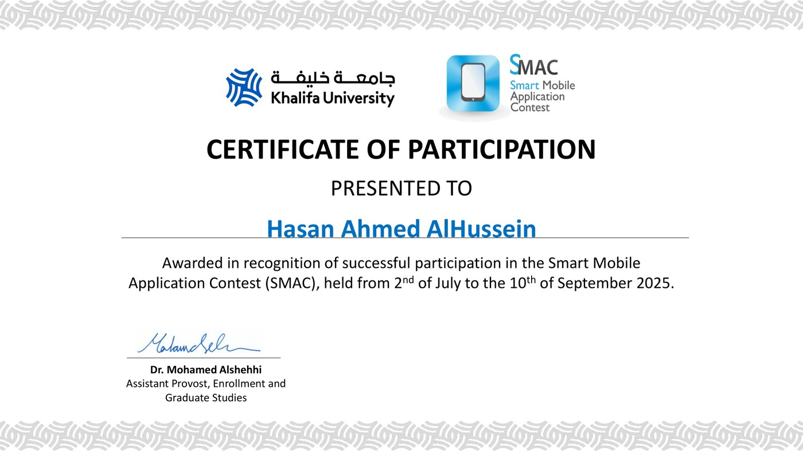
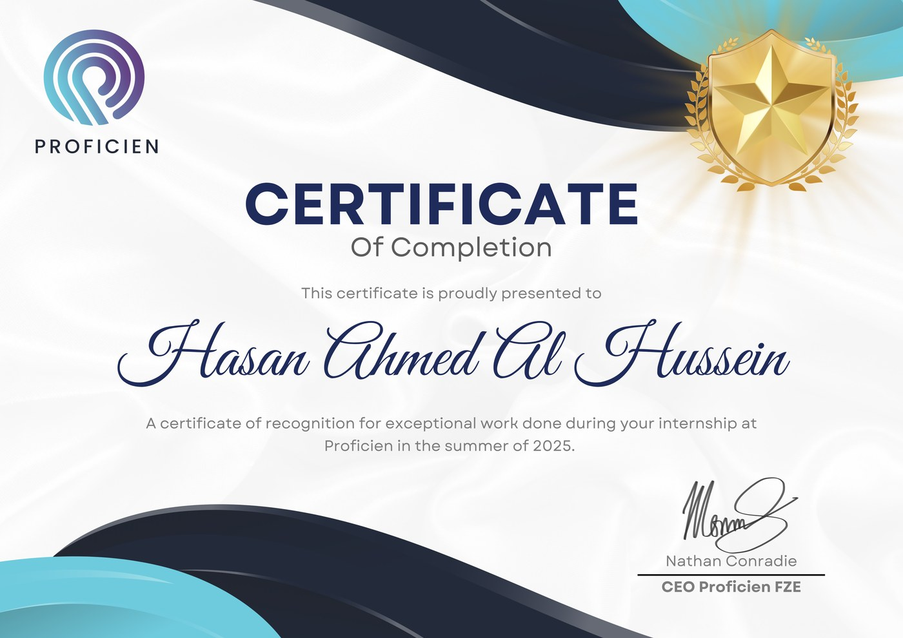
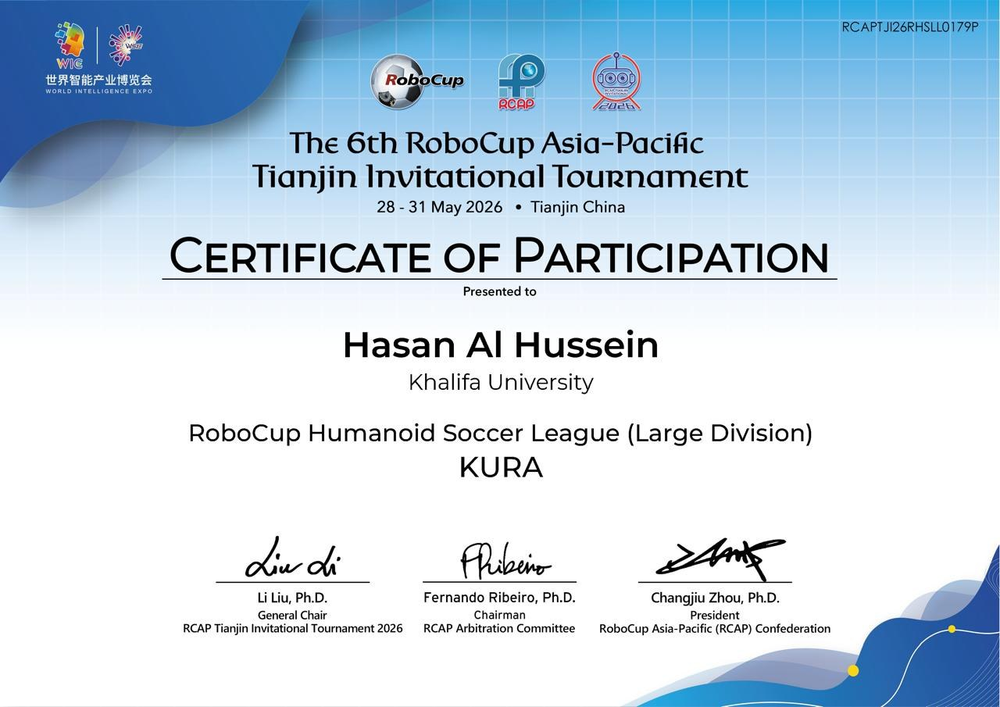
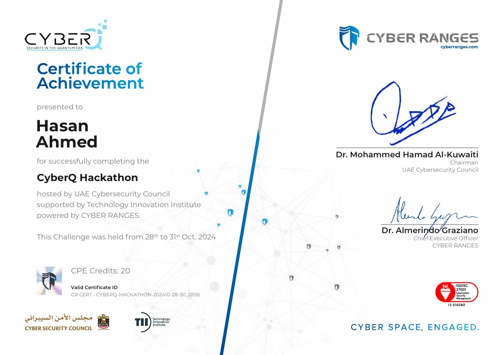
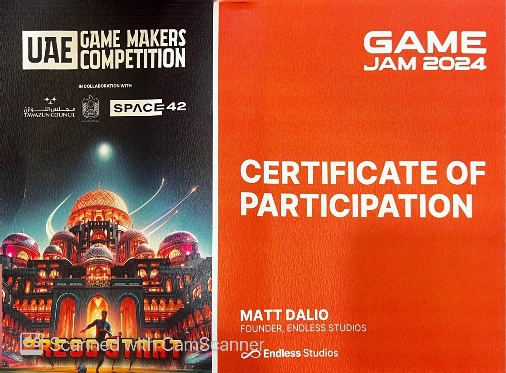
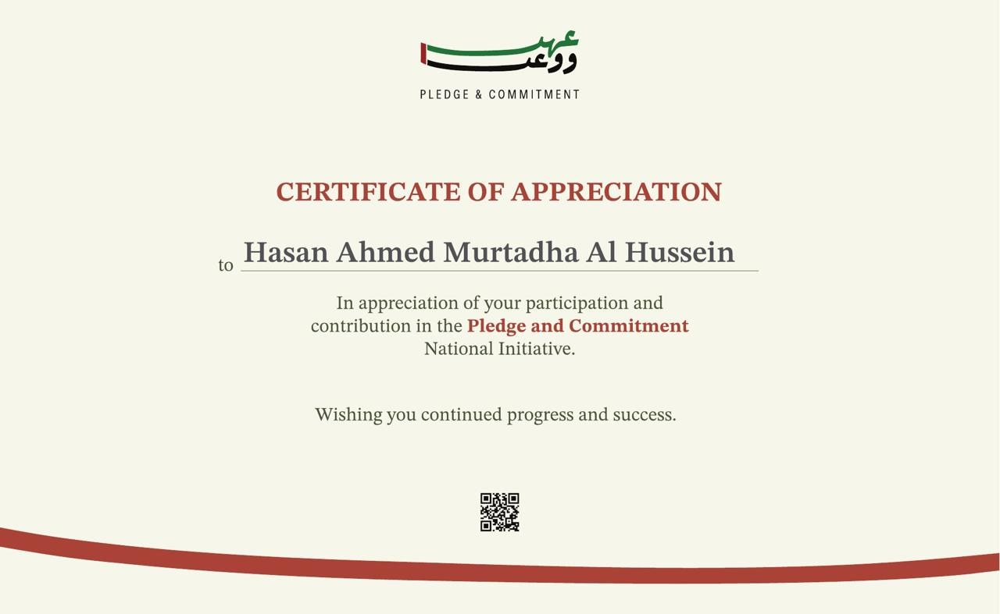

  

  
  
  

## Credential portfolio

This repository presents my academic credentials, professional training, robotics participation, competitions, and community achievements in one recruiter-friendly location. Select any preview to open the original certificate.

### Academic credentials and recognition

<table>
  <tr>
    <td width="50%" valign="top">
      
      <h3>BSc in Computer Engineering</h3>
      
<strong>Issuer:</strong> Khalifa University of Science and Technology 
      <strong>Awarded:</strong> July 20, 2026 
      Official bachelor's degree certificate.

      
<a href="certificates/khalifa-university-bsc-computer-engineering-degree.pdf"><strong>Open original PDF</strong></a>

    </td>
    <td width="50%" valign="top">
      
      <h3>English Medium Certificate</h3>
      
<strong>Issuer:</strong> Khalifa University 
      <strong>Issued:</strong> August 7, 2026 
      Confirms English as the official language of instruction and records an EMSAT English score of 1500.

      
<a href="certificates/khalifa-university-english-medium-certificate.pdf"><strong>Open original PDF</strong></a>

    </td>
  </tr>
  <tr>
    <td width="50%" valign="top">
      
      <h3>President's List - Fall 2023</h3>
      
<strong>Issuer:</strong> Khalifa University 
      <strong>Recognized:</strong> May 21, 2025 
      Honors Day recognition for academic achievement.

      
<a href="certificates/khalifa-university-honors-day-presidents-list.jpeg"><strong>Open original image</strong></a>

    </td>
    <td width="50%" valign="top">
      
      <h3>Smart Mobile Application Contest</h3>
      
<strong>Issuer:</strong> Khalifa University 
      <strong>Period:</strong> July 2 to September 10, 2025 
      Certificate of participation in SMAC.

      
<a href="certificates/khalifa-university-smart-mobile-application-contest.pdf"><strong>Open original PDF</strong></a>

    </td>
  </tr>
</table>

### Professional and robotics experience

<table>
  <tr>
    <td width="50%" valign="top">
      
      <h3>Proficien Internship Completion</h3>
      
<strong>Issuer:</strong> Proficien FZE 
      <strong>Period:</strong> Summer 2025 
      Recognition for exceptional work completed during the internship.

      
<a href="certificates/proficien-internship-completion.png"><strong>Open original image</strong></a>

    </td>
    <td width="50%" valign="top">
      
      <h3>RoboCup Asia-Pacific Tianjin 2026</h3>
      
<strong>Team:</strong> KURA, Khalifa University 
      <strong>Event:</strong> Humanoid Soccer League, Large Division 
      <strong>Dates:</strong> May 28 to 31, 2026

      
<a href="certificates/robocup-asia-pacific-tianjin-2026.jpeg"><strong>Open original image</strong></a>

    </td>
  </tr>
</table>

### Competitions and community achievements

<table>
  <tr>
    <td width="50%" valign="top">
      
      <h3>CyberQ Hackathon</h3>
      
<strong>Hosted by:</strong> UAE Cybersecurity Council 
      <strong>Supported by:</strong> Technology Innovation Institute 
      <strong>Dates:</strong> October 28 to 31, 2024 
      Certificate of achievement with 20 CPE credits.

      
<a href="certificates/cyberq-hackathon-2024.png"><strong>Open original image</strong></a>

    </td>
    <td width="50%" valign="top">
      
      <h3>UAE Game Makers Competition - Game Jam 2024</h3>
      
<strong>Partners:</strong> Tawazun Council and Space42 
      <strong>Organizer:</strong> Endless Studios 
      Certificate of participation.

      
<a href="certificates/uae-game-makers-game-jam-2024.jpeg"><strong>Open original image</strong></a>

    </td>
  </tr>
  <tr>
    <td width="50%" valign="top">
      
      <h3>Pledge and Commitment National Initiative</h3>
      
Certificate of appreciation for participation and contribution to the UAE national initiative.

      
<a href="certificates/uae-pledge-and-commitment-certificate.jpeg"><strong>Open original image</strong></a>

    </td>
    <td width="50%" valign="top">
      <h3>Contact</h3>
      
For professional inquiries or credential verification, connect with me through:

      <ul>
        <li><a href="https://www.linkedin.com/in/hasan-al-hussein">LinkedIn</a></li>
        <li><a href="https://github.com/Hasan-Al-Hussein">GitHub</a></li>
      </ul>
    </td>
  </tr>
</table>

## Document use

These documents are shared solely for professional credential review. Certificate artwork, institutional marks, signatures, and related intellectual property remain with their respective issuers. Unauthorized alteration or reuse is not permitted.

